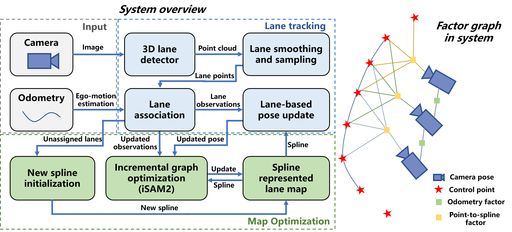
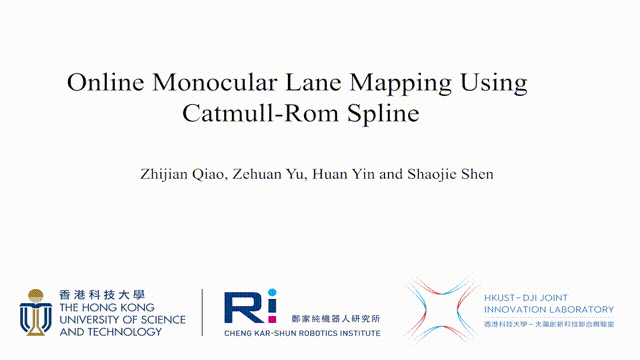

<div align="center">
    
</div>
<div align="center">
<a href="https://arxiv.org/abs/2307.11653"></a>
</div>

## Introduction

This is the official code repository of "Online Monocular Lane Mapping Using Catmull-Rom Spline", which is accepted by IROS'23.

MonoLaM (Monocular Lane Mapping) is an online lane mapping algorithm based on a monocular camera. It takes real-time images and odometry (such as from VIO), and estimates its own pose as well as the lane map. 

Its main features are:
+ MonoLaM uses a monocular 3D lane detection network to obtain 3D lane marking measurements.
+ Lane association using a combination of Chamfer distance, pose uncertainty, and lateral sequence consistency.
+ The lane marking is parameterized by the Catmull-Rom Spline, which saves the map memory.
+ Initializing control points for unordered lane line point clouds.
+ Incrementally extending and optimizing the lane map.

<div align="center">
    
</div>

## Prerequisites
### ROS
Follow the [official guide](http://wiki.ros.org/ROS/Installation) to install ROS1.
### Python Dependencies
```
pip install -r requirements.txt
```
### GTSAM
Follow the [official guide](https://gtsam.org/get_started/) to install GTSAM with [Python Bindings](https://github.com/borglab/gtsam/blob/develop/python/README.md).
### OpenLane ROS Package
```angular2html
mkdir -p catkin_ws/src
cd catkin_ws/src
git clone https://github.com/qiaozhijian/openlane_bag.git
```
## Build
```angular2html
git clone https://github.com/HKUST-Aerial-Robotics/MonoLaneMapping.git
cd ..
catkin_make
```

## OpenLane Example
We validate the method based on the [OpenLane](https://github.com/OpenDriveLab/OpenLane) dataset. Users need to download this dataset and the rosbags we provide after preprocessing with [openlane_bag](https://github.com/qiaozhijian/openlane_bag.git).

Specifically, we use [PersFormer](https://github.com/OpenDriveLab/PersFormer_3DLane) to predict 3D lane markings and save them along with GT and calibration parameters ([Details](docs/annotation.md)). The camera coord sys (OpenLane) is x-front, y-left, z-up. 
However, you may feel confused if you want preprocess by yourself using [PersFormer](https://github.com/OpenDriveLab/PersFormer_3DLane). Because its camera coord sys is different from OpenLane (please refer to [issue 24](https://github.com/OpenDriveLab/OpenLane/issues/24).

Rosbag download link [[OneDrive]](https://hkustconnect-my.sharepoint.com/:u:/g/personal/zqiaoac_connect_ust_hk/EQxCBwl1Wc5Foq1wNOJ7ZKQBrNik0GK_qa7qEed_zrbGmQ?e=bYSYvk)[[Baidu Cloud]](https://pan.baidu.com/s/1Hrd8ashoiB4_f0B-iz6OHQ?pwd=2023)

Unzip the downloaded file and put it in the `OpenLane dataset` folder.
```angular2html
├── OpenLane
│   └── lane3d_1000
│       ├── rosbag
│       └── test
│       └── validation
│       └── training
```
Modify the `config/lane_mapping.yaml` file to change the dataset path.
```angular2html
dataset:
    name: "openlane"
    dataset_dir: "/media/qzj/Document/datasets/OpenLane/"
```
**Quick Start**
```
python examples/demo_mapping.py --cfg_file=config/lane_mapping.yaml
```
**Reproduce the results in the paper**
```
cd src/MonoLaneMapping
# lane mapping and save the results
python examples/mapping_bm.py --cfg_file=config/lane_mapping.yaml
# evaluation of lane recall and precision
python examples/openlane_eval3d.py --cfg_file=config/lane_mapping.yaml
# lane association evaluation
python examples/lane_association.py --cfg_file config/lane_association.yaml --bm
```
**Toy example for curve fitting**
```
python examples/demo_curve_fitting.py
```
## Citation
If you find this work useful in your research, please consider citing:
```
@INPROCEEDINGS{qiao_monolam,
  author={Zhijian Qiao, Zehuan Yu, Huan Yin and Shaojie Shen},
  booktitle={2023 IEEE/RSJ International Conference on Intelligent Robots and Systems (IROS)}, 
  title={Online Monocular Lane Mapping Using Catmull-Rom Spline}, 
  year={2023},
  volume={},
  number={}}
```

## License
This project is licensed under the MIT License - see the [LICENSE](LICENSE) file for details.